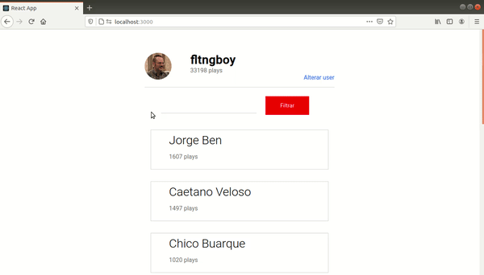

<h1 align="center">Charts By Tag.</h1>

<p align="center">O last.fm é um site que cataloga seu histórico de audições em players e serviços de streaming, transformando-o em tabelas e recomendações. Usando a API do site e React JS fiz uma página que filtra o top do usuário pelo gênero (tag) digitado</p>

<h2 align="center">Como testar.</h2>

<p align="center">É necessário instalar as ferramentas <a href='https://git-scm.com'>Git</a>, <a href='https://nodejs.org/'>Node.js</a> e <a href='https://pt-br.reactjs.org/'>ReactJs</a>. Também utilize o gerencionar de pacotes de sua preferência: NPM (já vem com o Node) e <a href='https://classic.yarnpkg.com/pt-BR/docs/install/'>Yarn </a>.</p>

1. Clone o projeto no repositório de preferência: 
```bash
git clone <https://github.com/diegofreitas11/chartsByTag.git>
```

2. Acesse a pasta do projeto:
```bash
cd chartByTag


3. Rode o projeto em desenvolvimento:
```bash
yarn start
```
ou
```bash
npm start
```

4. Acesse 'localhost:3000/' no navegador.

<h2 align="center">Alguns gifs.</h2>





